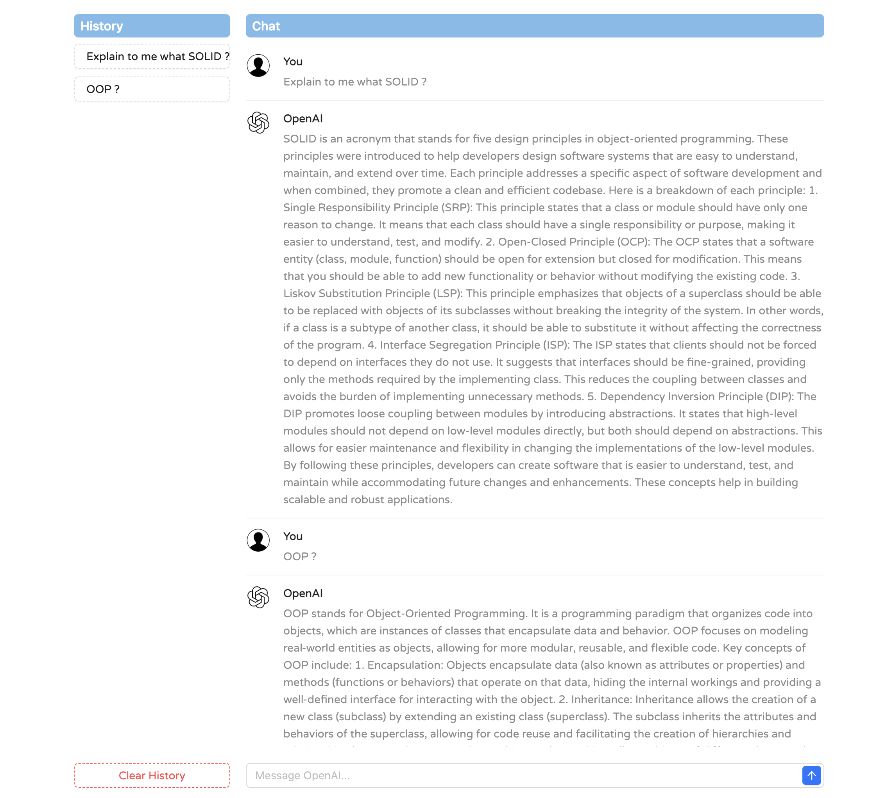

# React + TypeScript + OpenAI

This is an example integration of React with OpenAI, showcasing the power of combining these technologies.

## Steps

1. **Clone the Repository:**
   ```bash
   git clone https://github.com/khakimoff/ai-react-integration.git
   cd ai-react-integration

2. **Create OpenAI Account:**
    ```bash
    Create an account on OpenAI - https://platform.openai.com/docs/overview
    Navigate to the API keys section and generate a new API key

3. **Create .env:**
    ```bash
    Create a .env file in the root directory
    Set in .env VITE_APP_OPENAI_API_KEY with the generated API key

4. **Install and run:**
    ```bash
    npm install
    npm run dev


